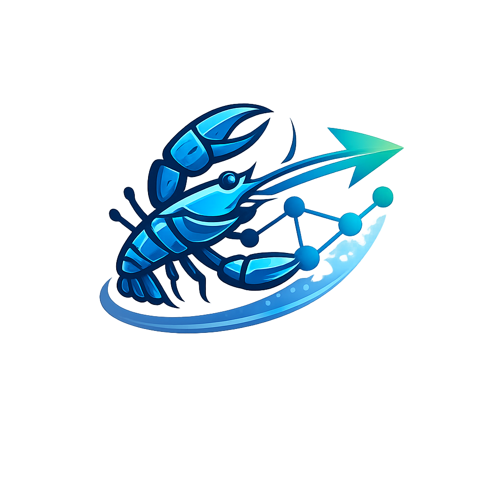

# ClawGraph

<p align="center">
  
</p>

### The learning harness for skill-driven agents

Skills make agents capable. Harnesses make them reliable.

ClawGraph captures real agent execution once, keeps execution facts immutable,
attaches supervision later, and turns long-running agent behavior into replay,
readiness checks, dataset snapshots, and rollout decisions.

If your team is shipping coding agents, research agents, browser agents, or
internal workflow agents, ClawGraph helps you answer the questions that appear
after the first demo works:

- Did this prompt, skill, or routing policy actually improve success?
- Which task slices improved, and which still need fallback?
- Which runs are reusable for SFT, preference learning, or binary RL?
- Can a smaller model or cheaper route safely cover this slice?

> Most agent tooling helps you build agents. ClawGraph helps you improve them.

[English](README.md) | [简体中文](README.zh-CN.md)

## Why ClawGraph exists

Agent teams now have better ways to package capabilities:

- skills and procedural knowledge
- tool-enabled runtimes
- long-running harness patterns
- route and fallback policies

But shipping those capabilities safely still requires a missing layer:

- capture what really happened
- replay retries, fallbacks, and subagent branches
- attach scores, critiques, and labels later
- export reusable datasets with lineage
- validate slice-by-slice before rollout

ClawGraph is that layer.

## What ClawGraph does

```text
skills / runtime policy / prompt scaffolding
    -> Proxy Capture Layer
    -> Immutable Fact Log
    -> Graph / Replay Views
    -> Artifact Overlays
    -> Dataset Builders
    -> Eval Suites / Scorecards / Feedback Loop
```

ClawGraph does not replace your runtime. It captures and structures execution so
you can learn from it repeatedly.

## Why teams use it

- Proxy-first adoption for existing OpenAI-compatible or OpenClaw-style runtimes
- Replay, inspect, and readiness from the same captured run
- Branch-aware execution for retries, fallbacks, and subagents
- Immutable facts plus versioned supervision artifacts
- Reusable JSONL exports with manifests and lineage
- Slice, cohort, evaluation, and rollout thinking built into the product model

## What you can prove with it

- A harness change improved success only on `slice.aiops.incident_triage`, not globally
- A retry policy created useful preference data instead of noisy traces
- A routing rule reduced cost without violating verifier pass rate on a covered slice
- A captured set of runs is good enough for a frozen `train / val / test` snapshot
- A shadow candidate should stay in offline evaluation instead of going to canary

## 5-minute quickstart

Validate one local loop before touching a real runtime:

```bash
python -m venv .venv
source .venv/bin/activate
pip install -e .

clawgraph bootstrap openclaw --store sqlite:///clawgraph.db
clawgraph inspect session --session latest
clawgraph replay --session latest
clawgraph readiness --session latest --builder preference
clawgraph export dataset --builder preference --session latest --dry-run
```

What you get:

- one complete OpenClaw-style session with one run
- one declared retry branch
- score and preference artifacts
- a dry-run preview of a dataset export

## Connect a real runtime later

Start with transparent proxy mode:

```bash
clawgraph proxy --model-upstream https://your-model-endpoint \
  --tool-upstream https://your-tool-endpoint \
  --store sqlite:///clawgraph.db
```

Then add more structure only where learning fidelity needs it.

Adoption ladder:

1. Transparent proxy: capture model and tool traffic with minimal changes
2. Context headers: add stable session, run, request, thread, or task identity
3. Semantic events: declare routing, retry, fallback, and branch intent

Typical high-value semantic signals:

- `plan_created`
- `subgoal_selected`
- `retry_declared`
- `fallback_declared`
- `branch_open_declared`
- `controller_route_decided`
- `stop_reason_declared`
- `uncertainty_reported`

## From runs to reusable learning data

ClawGraph is designed for the path after capture, not only capture itself.

Built-in builder families:

- `sft`
- `preference`
- `binary_rl`

Every export writes:

- JSONL records
- a sidecar manifest
- lineage fields for traceability
- deterministic split assignment for dataset snapshots

Typical repeated export flow:

```bash
clawgraph artifact bootstrap --template openclaw-defaults --session latest

clawgraph slice register --slice-id slice.capture \
  --task-family captured_agent_task \
  --task-type generic_proxy_capture \
  --taxonomy-version clawgraph.bootstrap.v1 \
  --sample-unit branch \
  --verifier-contract clawgraph.request_outcome_ratio.v1 \
  --risk-level medium \
  --default-use training_candidate \
  --owner ml-team

clawgraph slice candidates --slice-id slice.capture --min-quality-confidence 0.6
clawgraph cohort freeze --slice-id slice.capture --name capture-train
clawgraph export dataset --builder preference --cohort-id <cohort-id> --out out/preference.jsonl
```

## The object model that matters

Execution layer:

- `session`: durable container for related activity
- `run`: one execution episode inside a session
- `request`: one model, tool, or runtime call inside a run
- `branch`: one alternate path inside a run

Governance layer:

- `slice`: stable task category
- `cohort`: frozen set of approved examples
- `dataset snapshot`: one reproducible `train / val / test` export
- `eval suite`: one fixed validation asset
- `scorecard`: one experiment result for a slice
- `promotion decision`: one rollout gate

This boundary is deliberate. Facts should stay stable even when your builders,
judges, and reward logic change.

## Why this is not just tracing

Traditional tracing systems optimize for:

- monitoring
- latency analysis
- dashboards
- alerting

ClawGraph optimizes for:

- immutable execution facts
- branch-aware replay
- typed supervision attachment
- dataset construction
- slice-by-slice evaluation and rollout reasoning

If you only need operational visibility, use tracing. If you need learning
reuse, replay-grounded supervision, and governed export, use ClawGraph.

## Three workflow shapes

### 1. Zero-config runtime capture

Best for:

- fast production onboarding
- teams that want signal before runtime changes
- first replay and readiness checks

### 2. Semi-automatic pipeline

Best for:

- RL engineers
- platform teams gating export
- evaluation teams freezing cohorts and snapshots

### 3. Manual control

Best for:

- evaluator reruns
- hand-authored artifacts
- research workflows that need exact supervision control

The recommended order for most teams is:

1. start with zero-config capture
2. move to slice and cohort-based repeated export
3. drop to manual control only when built-in templates are not enough

## Choose your path

| Goal | Link |
| --- | --- |
| Fastest first run | [`docs/guides/start_here.md`](docs/guides/start_here.md) |
| One guided path from first run to export | [`docs/guides/fifteen_minute_path.md`](docs/guides/fifteen_minute_path.md) |
| Connect OpenClaw or another OpenAI-compatible runtime | [`docs/guides/openclaw_integration.md`](docs/guides/openclaw_integration.md) |
| Decide how automated the workflow should be | [`docs/guides/workflow_overview.md`](docs/guides/workflow_overview.md) |
| Inspect replay, branches, and readiness | [`docs/guides/replay_and_debug.md`](docs/guides/replay_and_debug.md) |
| Export datasets for training | [`docs/guides/dataset_builders.md`](docs/guides/dataset_builders.md) |
| Add richer runtime semantics | [`docs/guides/semantic_mode.md`](docs/guides/semantic_mode.md) |
| Browse runnable examples | [`examples/README.md`](examples/README.md) |
| Chinese docs | [`docs/zh-CN/README.md`](docs/zh-CN/README.md) |

## Core commands

- `clawgraph bootstrap`
- `clawgraph proxy`
- `clawgraph replay`
- `clawgraph inspect`
- `clawgraph artifact bootstrap`
- `clawgraph readiness`
- `clawgraph pipeline run`
- `clawgraph export dataset`
- `clawgraph list readiness`

## Current strengths

- proxy-first capture is implemented
- immutable fact logging is implemented
- replay and inspect are implemented
- built-in `sft`, `preference`, and `binary_rl` builders are implemented
- slice, cohort, eval suite, scorecard, and feedback governance are already part of the design model

## Current gaps

ClawGraph already has the substrate, but some roadmap items still matter for
teams building richer harnesses:

- stronger planner and controller semantics
- step-level process supervision inputs
- process RM and OPD builder families
- richer replay overlays and audit views
- production hardening beyond repeated full-run scans

See the roadmap for implementation status and sequencing.

## What ClawGraph is not

- not a new agent runtime
- not a skill marketplace
- not a trainer
- not tied to one RL recipe
- not only tracing

ClawGraph is the layer between runtime execution and learning decisions.

## Docs

- Start here: [`docs/guides/start_here.md`](docs/guides/start_here.md)
- 15-minute path: [`docs/guides/fifteen_minute_path.md`](docs/guides/fifteen_minute_path.md)
- OpenClaw integration: [`docs/guides/openclaw_integration.md`](docs/guides/openclaw_integration.md)
- Workflow overview: [`docs/guides/workflow_overview.md`](docs/guides/workflow_overview.md)
- Replay and debug: [`docs/guides/replay_and_debug.md`](docs/guides/replay_and_debug.md)
- Dataset builders: [`docs/guides/dataset_builders.md`](docs/guides/dataset_builders.md)
- Semantic mode: [`docs/guides/semantic_mode.md`](docs/guides/semantic_mode.md)
- What is ClawGraph: [`docs/overview/what_is_clawgraph.md`](docs/overview/what_is_clawgraph.md)
- Architecture: [`docs/overview/architecture.md`](docs/overview/architecture.md)
- Why not tracing: [`docs/overview/why_not_tracing.md`](docs/overview/why_not_tracing.md)
- Chinese docs: [`docs/zh-CN/README.md`](docs/zh-CN/README.md)
- Examples: [`examples/README.md`](examples/README.md)
- CLI reference: [`docs/reference/cli_reference.md`](docs/reference/cli_reference.md)

## Project files

- Roadmap: [`ROADMAP.md`](ROADMAP.md)
- Backlog: [`BACKLOG.md`](BACKLOG.md)
- Contributing: [`CONTRIBUTING.md`](CONTRIBUTING.md)
