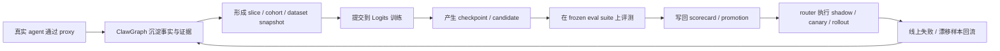
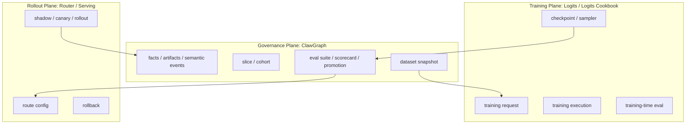

# 设计方案：ClawGraph 与 Logits 训练、评测、替代闭环集成

## 1. 文档目标

本文把 `ClawGraph` 与同级目录中的 `logits`、`logits-cookbook` 串成一条完整、可实施的产品与技术方案。

目标不是把三套系统揉成一个大而全平台，而是明确三者边界，并定义一条可审计、可回放、可替代验证的标准闭环：

```text
proxy facts
  -> evidence / artifact / slice / cohort
  -> dataset snapshot
  -> external training on Logits
  -> checkpoint / candidate model
  -> evaluation on frozen eval suites
  -> scorecard / promotion decision
  -> serving rollout and feedback
```

本文同时给出：

- 产品视角下的完整流程与角色分工
- 技术架构与对象边界
- 数据契约与文件格式
- 分阶段实施任务
- 测试矩阵
- 阶段 checkpoint 与验收标准

## 2. 一句话结论

当前最合理的整体方案是：

1. `ClawGraph` 继续做学习数据与替代验证的治理控制面。
2. `logits` 和 `logits-cookbook` 负责训练执行、checkpoint 产出、训练期评测与模型发布。
3. serving / router 作为第三平面，消费 `promotion decision`，决定是否进入 `shadow / canary / rollout`。
4. 第一条必须打通的链路是 `SFT snapshot -> Logits supervised training -> frozen eval suite -> scorecard -> promotion`。
5. `preference -> DPO` 作为第二阶段；环境驱动的 agent RL 作为第三阶段，不应直接把现有 `binary_rl` 导出等价成在线 RL。

## 3. 现状与缺口

### 3.1 ClawGraph 当前已具备的能力

从当前设计文档和实现看，`ClawGraph` 已经具备以下骨架：

- `proxy` 捕获真实 agent 流量
- `fact / artifact / semantic event` 证据层
- `slice / cohort` 治理层
- `dataset snapshot` 导出层
- `eval suite / scorecard / promotion decision` 决策层

当前 `phase2` 已能自动串起：

```text
prepare
  -> judge
  -> slice
  -> cohort freeze
  -> export dataset
  -> create eval suite
  -> record scorecard
  -> record promotion
```

这条链路已经足以支撑“数据治理闭环”和“评测资产闭环”。

### 3.2 ClawGraph 当前明确不负责的能力

按现有设计，`ClawGraph` 不应直接承担：

- 参数训练本身
- checkpoint 生命周期执行
- 线上 serving 基础设施
- 实际路由切流执行

这条边界需要保留，否则 `ClawGraph` 会从治理控制面退化成难维护的混合训练系统。

### 3.3 Logits / Logits Cookbook 当前适合承担的能力

同级目录里的两套系统定位清晰：

- `logits`
  - 训练与采样的 SDK
  - 提供 `ServiceClient.create_lora_training_client(...)`
  - 提供 `ServiceClient.create_sampling_client(...)`
- `logits-cookbook`
  - 在 SDK 之上的 recipe 层
  - 提供 supervised、preference、RL、eval 相关 recipe
  - 已支持 conversation JSONL、comparison JSONL、Inspect 风格 eval

这使得它天然适合作为 `ClawGraph` 下游的训练与评测执行平面。

### 3.4 当前真正缺的不是 builder，而是训练桥接层

当前缺口主要有四类：

1. 没有从 `dataset snapshot` 发起训练任务的标准桥接层。
2. 没有“checkpoint / model candidate”与 `dataset snapshot / eval suite / scorecard` 的稳定绑定。
3. 没有“拿 checkpoint 跑 frozen eval suite，并把结果写回 ClawGraph”的标准执行器。
4. 没有“消费 promotion decision 并执行 serving 切流”的 adapter。

换句话说，现在缺的是 `governance plane <-> training plane <-> rollout plane` 之间的桥，而不是再扩一套新的事实模型。

## 4. 产品设计

### 4.1 产品定位

集成完成后的产品，应被理解成三层协同系统：

- `ClawGraph`
  数据治理、训练资产、评测资产、替代决策的控制面
- `Logits / Logits Cookbook`
  训练执行、checkpoint、训练期评测、模型发布执行面
- `Serving / Router`
  线上覆盖、shadow、canary、rollback 执行面

对用户来说，它应该回答的是：

1. 哪些真实任务流量已经沉淀成可训练数据？
2. 这些数据训练出了哪些候选模型？
3. 候选模型在固定评测资产上是否赢过基线？
4. 哪些任务切片允许进入 `shadow / canary / rollout`？
5. 失败与漂移样本如何回流到下一轮训练？

### 4.2 用户角色

| 角色 | 关注点 | 核心动作 |
| --- | --- | --- |
| 平台负责人 | 链路是否稳定、是否具备替代闭环 | 审核 checkpoint、scorecard、promotion |
| 数据 / 训练工程师 | 数据快照是否可训练、训练任务是否成功 | 冻结 cohort、提交训练、跟踪训练任务 |
| 评测工程师 | 新模型是否真实优于基线 | 运行 eval、解释失败、回写 scorecard |
| 产品 / 方案负责人 | 哪些任务切片可覆盖、风险在哪里 | 查看 coverage、rollout、回滚条件 |
| Runtime / Serving 工程师 | 如何执行 shadow / canary / rollback | 消费 promotion decision、执行路由更新 |

### 4.3 目标用户流程



### 4.4 面向市场的产品叙事

对外叙事不应是“我们可以抓日志然后训练小模型”，而应是：

1. 从真实生产流量中形成可治理、可审计的训练快照。
2. 使用外部训练系统训练出候选模型，并保留完整血缘。
3. 在隔离的评测资产上完成严格对照，产出标准 scorecard。
4. 仅在通过切片级验证后，才允许进入受控放量。
5. 所有失败与漂移都能回到 review queue、cohort refresh 与下一轮 snapshot。

这比“自动训练小模型”更准确，也更符合现有架构边界。

## 5. 技术架构

### 5.1 三平面结构



### 5.2 基本边界

#### ClawGraph 必须负责

- 冻结 `dataset snapshot`
- 冻结 `eval suite`
- 记录 `scorecard`
- 记录 `promotion decision`
- 维护 `feedback queue`
- 保存数据、训练、评测、放量之间的血缘关系

#### Logits 必须负责

- 启动训练任务
- 输出 checkpoint / sampler path
- 加载 checkpoint 做采样
- 运行 recipe 级 supervised / preference / RL 训练
- 运行训练期或离线 eval

#### Router / Serving 必须负责

- 将某个 `promotion decision` 变成具体路由配置
- 执行 `shadow / canary / rollout / rollback`
- 回写线上表现与异常样本

### 5.3 过渡态对象设计

当前不建议立即把“训练任务”和“候选模型”做成复杂一等 schema；更合理的是先用一组稳定 manifest / artifact 接起来，等跑通后再决定是否升级为一等对象。

建议最小对象为：

| 对象 | 初始载体 | 作用 |
| --- | --- | --- |
| `training request manifest` | JSON 文件或 artifact | 定义一次训练的输入与参数 |
| `model candidate manifest` | JSON 文件或 artifact | 记录 checkpoint、基线、训练来源 |
| `eval execution manifest` | JSON 文件或 artifact | 记录某个 candidate 在某个 eval suite 上的实际评测 |
| `router handoff manifest` | JSON 文件或 artifact | 记录 promotion 到 router 的交接材料 |

这些 manifest 不替代 `dataset snapshot / eval suite / scorecard / promotion`，而是把外部训练与执行信息挂接回来。

### 5.4 推荐目录形态

第一阶段建议放在 `ClawGraph` 仓库内，但必须保持为适配层，不污染核心对象模型：

```text
clawgraph/src/clawgraph/integrations/logits/
  __init__.py
  manifests.py
  sft_adapter.py
  preference_adapter.py
  training_bridge.py
  eval_bridge.py
  router_bridge.py
```

职责要求：

- `manifests.py`
  负责训练请求、候选模型、评测执行、router handoff 的结构定义
- `sft_adapter.py`
  把 `ClawGraph sft snapshot` 映射到 cookbook conversation JSONL
- `preference_adapter.py`
  把 `preference snapshot` 映射到 cookbook labeled comparison JSONL
- `training_bridge.py`
  负责提交训练、轮询状态、记录 candidate manifest
- `eval_bridge.py`
  负责把 eval suite 转成 evaluator 输入、收集结果、写回 scorecard
- `router_bridge.py`
  负责把 promotion decision 转成交接材料，供 serving 消费

如果后续出现独立 worker、异步任务队列、跨环境训练调度，再将其拆到独立服务，但第一阶段不需要为了架构纯洁而提前拆分。

## 6. 数据契约

### 6.1 SFT：直接对接 conversation JSONL

这是第一条最容易打通的路径。

`ClawGraph` 当前 `sft` 导出已经包含 `messages` 字段，而 `logits-cookbook` 的 supervised builder 已支持从 conversation JSONL 直接构建数据集。

推荐契约：

```json
{
  "dataset_snapshot_id": "ds_xxx",
  "builder": "sft",
  "records": [
    {
      "sample_id": "sample_xxx",
      "messages": [
        {"role": "system", "content": "You are ..."},
        {"role": "user", "content": "Fix bug ..."},
        {"role": "assistant", "content": "Here is the patch ..."}
      ],
      "metadata": {
        "slice_id": "slice.xxx",
        "task_family": "captured_agent_task",
        "task_type": "generic_proxy_capture",
        "task_instance_key": "sqlfluff__sqlfluff-1625",
        "teacher_model": "deepseek-chat"
      }
    }
  ]
}
```

P1 阶段不要求再做复杂转换；重点是确保：

- `messages` 顺序不丢失
- `system / user / assistant` 角色不变形
- `task_instance_key / slice_id / teacher_model` 可追溯

### 6.2 Preference：转换成 labeled comparison JSONL

`ClawGraph preference snapshot` 与 cookbook 的 DPO 输入结构不完全相同，因此需要一层稳定转换。

建议映射：

- `prompt` -> `comparison.prompt_conversation`
- `chosen` -> `comparison.completion_A`
- `rejected` -> `comparison.completion_B`
- `label` -> `"A"`

示例：

```json
{
  "comparison": {
    "prompt_conversation": [
      {"role": "user", "content": "Solve task X"}
    ],
    "completion_A": {
      "messages": [{"role": "assistant", "content": "chosen answer"}]
    },
    "completion_B": {
      "messages": [{"role": "assistant", "content": "rejected answer"}]
    }
  },
  "label": "A",
  "metadata": {
    "dataset_snapshot_id": "ds_pref_xxx",
    "slice_id": "slice.xxx",
    "task_instance_key": "instance_xxx"
  }
}
```

关键约束：

- 只能在同一 `task_instance_key` 下成对
- 不做跨任务实例的“拼接偏好”
- 需要保留 pair 来源与比较依据

### 6.3 Binary RL：不直接等价成 cookbook 在线 RL 输入

`ClawGraph binary_rl` 当前更接近“离线 reward 样本”，而不是 cookbook 里的环境驱动 RL 轨迹。

因此本方案明确规定：

- P1 不把 `binary_rl snapshot` 直接送进 `logits-cookbook` RL recipe
- P2 也不把它伪装成完整 trajectory group
- 后续 RL 方案必须以 `slice-specific env + verifier` 为中心重新定义

更合理的用法是：

- 先用 `binary_rl` 做 reward 校准或筛选
- 再为高价值 slice 单独建设环境和 verifier
- 最后再接 cookbook 的 RL recipe

### 6.4 候选模型血缘契约

每个 candidate 必须能追溯回训练数据、训练参数和评测结果。

最小字段：

```json
{
  "candidate_model_id": "cand_xxx",
  "training_system": "logits",
  "training_recipe": "supervised.chat_sl",
  "base_model": "meta-llama/Llama-3.2-1B",
  "dataset_snapshot_id": "ds_xxx",
  "dataset_builder": "sft",
  "training_request_id": "train_xxx",
  "checkpoint_path": "logits://checkpoint/...",
  "sampler_path": "logits://sampler/...",
  "metadata": {
    "slice_id": "slice.xxx",
    "cohort_id": "cohort_xxx",
    "manifest_version": "v1"
  }
}
```

### 6.5 Eval 输入输出契约

推荐把 `eval suite` 视为不可变评测资产，而不是临时脚本输入。

输入：

```json
{
  "eval_suite_id": "eval_xxx",
  "suite_kind": "offline_test",
  "slice_id": "slice.xxx",
  "candidate_model_id": "cand_xxx",
  "baseline_model": "deepseek-chat"
}
```

输出：

```json
{
  "eval_execution_id": "evalexec_xxx",
  "eval_suite_id": "eval_xxx",
  "candidate_model_id": "cand_xxx",
  "metrics": {
    "task_success_rate": 0.86,
    "verifier_pass_rate": 0.84,
    "p95_latency": 4300,
    "unit_cost": 0.31
  },
  "thresholds": {
    "task_success_rate": {"op": "gte", "value": 0.8},
    "verifier_pass_rate": {"op": "gte", "value": 0.8},
    "p95_latency": {"op": "lte", "value": 5000}
  }
}
```

然后由 `eval_bridge` 显式调用：

- `record_scorecard(...)`
- `record_promotion_decision(...)`

这里不要强行复用“从旧 run 的 score artifact 自动推导 scorecard”的隐式路径。

## 7. 目标闭环

### 7.1 第一阶段目标闭环：SFT

```text
slice-ready runs
  -> training cohort
  -> sft snapshot
  -> training request manifest
  -> Logits supervised job
  -> checkpoint / sampler
  -> eval suite execution
  -> scorecard
  -> promotion decision
```

### 7.2 第二阶段目标闭环：Preference / DPO

```text
same-instance preference pairs
  -> preference snapshot
  -> labeled comparison adapter
  -> Logits DPO job
  -> checkpoint / sampler
  -> eval suite execution
  -> scorecard / promotion
```

### 7.3 第三阶段目标闭环：环境驱动 RL

```text
slice-specific env + verifier
  -> trajectory collection
  -> Logits RL recipe
  -> checkpoint / sampler
  -> offline + shadow eval
  -> scorecard / promotion
```

## 8. 任务拆解

### Phase 0：契约冻结与脚手架

目标：

- 固化 manifest 结构
- 固化 adapter 边界
- 不改动 ClawGraph 核心对象模型

任务：

1. 新增 `integrations/logits/manifests.py`
2. 定义 `training request / model candidate / eval execution / router handoff` schema
3. 定义 CLI 或 worker 入口命名规范
4. 明确 `logits` 配置来源，如 `LOGITS_API_KEY / LOGITS_BASE_URL`

交付物：

- manifest dataclass 或 typed schema
- 一份最小示例 manifest
- 文档中的 I/O 契约固化

验收：

- 所有 manifest 都能序列化 / 反序列化
- manifest 能稳定引用 `dataset_snapshot_id / eval_suite_id / scorecard_id`

### Phase 1：SFT 训练桥接

目标：

- 打通 `sft snapshot -> Logits supervised training`

任务：

1. 实现 `sft_adapter.py`
2. 将 `dataset snapshot` 导出为 cookbook 可消费的 conversation JSONL
3. 实现 `training_bridge.submit_sft_training(...)`
4. 保存 `training request manifest`
5. 训练完成后写出 `model candidate manifest`

交付物：

- `snapshot -> conversation JSONL` 转换器
- supervised 训练提交器
- candidate manifest 生成器

验收：

- 至少一版真实 `sft snapshot` 能成功发起训练
- 产出 checkpoint path / sampler path
- 训练血缘能回溯到 `dataset_snapshot_id`

### Phase 2：Checkpoint 评测与决策写回

目标：

- 打通 `candidate checkpoint -> frozen eval suite -> scorecard -> promotion`

任务：

1. 实现 `eval_bridge.py`
2. 将 `eval suite` 转为 evaluator 输入
3. 使用 `logits` sampling client 对 candidate checkpoint 跑评测
4. 汇总 metrics
5. 显式调用 `record_scorecard(...)`
6. 显式调用 `record_promotion_decision(...)`

交付物：

- eval runner
- scorecard writeback
- promotion writeback

验收：

- 新 checkpoint 能在固定 eval suite 上跑通
- `ClawGraph dashboard` 可见新 scorecard 和 promotion
- 同一 suite 可以稳定对照 baseline 与 candidate

### Phase 3：Preference / DPO

目标：

- 打通 `preference snapshot -> DPO training`

任务：

1. 实现 `preference_adapter.py`
2. 将 `ClawGraph preference snapshot` 转为 labeled comparison JSONL
3. 实现 `training_bridge.submit_dpo_training(...)`
4. 复用 Phase 2 的 eval 回写链路

交付物：

- labeled comparison 转换器
- DPO 训练提交器

验收：

- 同任务实例下的 chosen / rejected pair 可稳定转成 comparison dataset
- DPO checkpoint 能进入与 SFT 一致的 eval / scorecard / promotion 流

### Phase 4：Router Handoff

目标：

- 将 `promotion decision` 变成可执行的路由交接材料

任务：

1. 实现 `router_bridge.py`
2. 从 `promotion decision` 和 `coverage policy` 生成 router handoff manifest
3. 明确 `shadow / canary / rollout / rollback` 的交付字段
4. 支持 dry-run 校验

交付物：

- router handoff manifest
- dry-run validator

验收：

- 每个可放量 candidate 都能产出路由交接材料
- rollback condition 可被显式列出，不再停留在口头规则

### Phase 5：环境驱动 RL

目标：

- 在高价值 slice 上引入真正可验证的 agent RL

任务：

1. 为选定 slice 定义 env / verifier
2. 实现 trajectory -> RL recipe 的桥接
3. 引入 offline + shadow 双重验证
4. 把 RL 候选模型接入已有 scorecard / promotion 流

交付物：

- slice-specific RL env
- RL eval bridge

验收：

- 至少一个高价值 slice 能完成端到端 RL 实验
- RL 候选模型的表现以统一 scorecard 展示

### 当前实现边界说明（2026-04）

到当前代码版本，`Logits x ClawGraph` 已经具备：

- `dataset snapshot -> training request manifest`
- `training request -> model candidate manifest`
- `candidate -> eval execution / scorecard / promotion`
- `promotion -> router handoff manifest`
- store-backed training registry，并兼容 manifest 导入，可被 Web 详情页和 CLI 统一读取

但内建评测桥当前稳定支持的是：

- 基于 `sft` 风格对话样本的 offline eval

因此，本文中对 “统一 DPO / RL 候选评测” 的描述应理解为目标架构，而不是当前已经完全实现的能力。
在没有 slice-specific env / verifier 之前：

- `preference` 可以进入训练桥，但评测通常仍需回到离线对话比较或外部 grader
- `binary_rl` 不应被误解为可直接替代 env-based RL 的线上训练输入
- 真正的 env / verifier-driven RL 评测仍需要 Phase 5 单独建设

## 9. 测试矩阵

### 9.1 单元测试

#### Manifest 与配置

- `training request manifest` 序列化 / 反序列化
- `model candidate manifest` 序列化 / 反序列化
- `eval execution manifest` 序列化 / 反序列化
- `router handoff manifest` 序列化 / 反序列化
- `logits://` 与 `tinker://` 路径解析

#### SFT Adapter

- `messages` 不丢 role、不改顺序
- 空 system message、长对话、tool call 混入时仍能稳定导出
- `dataset_snapshot_id / slice_id / task_instance_key` 元数据保留

#### Preference Adapter

- 一个 preference 样本能稳定转成 labeled comparison
- 缺失 `task_instance_key` 时拒绝构建 pair
- chosen / rejected 为空时拒绝导出

#### Eval Bridge

- eval suite 转 evaluator 输入成功
- metrics 能稳定映射到 `record_scorecard(...)`
- 阈值判定结果与 `scorecard.verdict` 一致

### 9.2 集成测试

#### Snapshot -> Training Request

- 从冻结 cohort 导出 `sft snapshot`
- 由 snapshot 生成 training request manifest
- training request 能绑定正确 builder、slice、base model

#### Training -> Candidate

- mock 训练返回 checkpoint / sampler path
- candidate manifest 成功落地
- candidate 与 snapshot、training request 建立血缘

#### Candidate -> Eval -> Scorecard

- mock sampling client 对 eval suite 生成结果
- 汇总 metrics 并写回 scorecard
- 根据 verdict 自动生成 promotion

#### Failure Path

- 训练失败时不产生 candidate
- eval 失败时不产生 promote
- 指标不达标时 promotion 为 `hold` 或 `rollback`

### 9.3 真实环境验证

#### Live SFT 验证

1. 选取一个真实 `sft snapshot`
2. 提交 Logits supervised 训练
3. 产出可采样 checkpoint
4. 使用 sampling client 做最小 smoke sample

#### Live Eval 验证

1. 使用固定 `eval suite`
2. 基线模型和 candidate 跑同一批 case
3. 将 metrics 写回 `scorecard`
4. 在 Dashboard 中确认 promotion 可见

#### Live Rollout Dry-run

1. 读取 promotion decision
2. 生成 router handoff manifest
3. 执行 dry-run 校验，不真正切流

## 10. Checkpoint 与验收门槛

### C0：方案冻结

定义：

- manifest 结构确定
- 目录结构确定
- Phase 1 到 Phase 5 的边界确定

通过标准：

- 设计文档评审通过
- `ClawGraph` 与 `Logits` 的职责边界无争议

### C1：SFT 数据桥接可用

定义：

- `sft snapshot` 能稳定转成 cookbook conversation JSONL

通过标准：

- 至少一个真实 snapshot 转换成功
- 转换结果可被 supervised recipe 正常读取

### C2：训练任务可用

定义：

- 能从 snapshot 发起 supervised 训练

通过标准：

- 至少一个训练任务成功完成
- 产出 checkpoint / sampler path
- candidate manifest 完整

### C3：评测写回可用

定义：

- 新 checkpoint 能在 frozen eval suite 上得到标准 scorecard

通过标准：

- 至少一版 candidate 成功生成 scorecard
- promotion decision 成功写回

### C4：替代交接材料可用

定义：

- promotion decision 能生成 router handoff manifest

通过标准：

- 至少一个 `promote` verdict 可生成 dry-run handoff
- rollback condition 完整

### C5：Preference / DPO 可用

定义：

- `preference snapshot` 可以稳定进入 DPO 训练

通过标准：

- 至少一个 preference 数据集完成训练与评测闭环

### C6：环境驱动 RL 可用

定义：

- 至少一个高价值 slice 完成 env-based RL 实验

通过标准：

- RL checkpoint 能进入统一的评测与决策流程

## 11. 非目标与风险

### 11.1 非目标

当前方案明确不做：

- 把实时 proxy 流量直接喂给在线梯度更新
- 把 `ClawGraph` 改造成训练集群调度器
- 把 `score artifact` 的旧自动推导路径当作所有 candidate eval 的唯一入口
- 在没有 `slice / cohort / snapshot` 的情况下直接从“最新 run”训练

### 11.2 关键风险

#### 风险一：训练血缘断裂

如果 checkpoint 不能回溯到 `dataset_snapshot_id`、`eval_suite_id` 和 `scorecard_id`，后续替代叙事会失去可信度。

#### 风险二：把评测和训练混在一起

如果直接复用训练数据或 run 内 score artifact 做 candidate 模型评测，会导致“看起来闭环，实际上不可审计”。

#### 风险三：过早进入 RL

如果在没有 slice-specific env / verifier 的情况下强推 RL，会把 `binary_rl` 误用成在线 RL 替代物，结果不可解释。

#### 风险四：过早抽象成大而全平台

如果在 P1 阶段就试图把 training registry、serving registry、rollout execution 全部内建，会拖慢最关键的 `SFT -> eval -> promotion` 首条闭环。

## 12. 推荐实施顺序

推荐按下面顺序推进，而不是并行大爆炸：

1. Phase 0：冻结契约与 manifest
2. Phase 1：打通 `SFT snapshot -> Logits supervised`
3. Phase 2：打通 `checkpoint -> eval suite -> scorecard -> promotion`
4. Phase 4：先做 router handoff dry-run
5. Phase 3：再补 `preference -> DPO`
6. Phase 5：最后进入环境驱动 RL

原因是：

- `SFT` 的数据契约已经天然对齐
- checkpoint eval 与 promotion 写回能最快证明“训练闭环”是否成立
- DPO 与 RL 都依赖更强的数据与评测纪律，不应先于 SFT

## 13. 对当前产品叙事的最终对齐

在这个方案下，当前产品对内对外都应统一成下面这句话：

`ClawGraph` 负责把真实 agent 流量治理成训练快照、评测资产和替代决策；`Logits` 负责把这些快照训练成候选模型并完成可执行评测；线上路由只在 promotion 通过后才消费这些结论。

这既符合当前实现现状，也为后续真正的模型替代留出了清晰、可持续扩展的技术边界。
