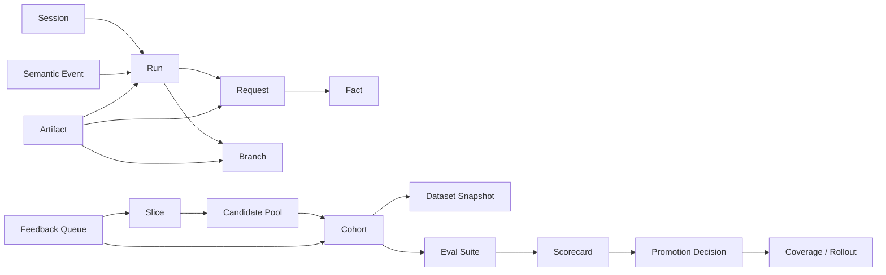

# 面向用户的 ClawGraph Dashboard 产品设计文档

## 1. 文档目标

本文基于当前 `clawgraph` 代码、CLI、设计文档与对象模型，设计一套面向用户的 Dashboard。

目标不是发明一套脱离系统现实的新前台，而是把 ClawGraph 现有和近端可落地的能力，整理成：

- 模块尽量与底层对象和分层能力一一对应
- 同时支持从用户故事出发的一站式操作
- 既满足平台 / 训练 / 评估团队，也能给产品经理和 BD 提供可读的业务视角

本文默认读者包括：

- 平台负责人
- Runtime 工程师
- RL / 数据工程师
- 评估与质量团队
- 产品经理
- BD / 解决方案团队

## 2. 对 ClawGraph 的产品理解

### 2.1 一句话定位

ClawGraph 不是 agent runtime，不是训练引擎，也不是单纯的 tracing 平台。

对外更适合的一级定位是：

一个把真实 agent 执行稳定转化为训练数据、验证资产和替代建议的控制面。

### 2.2 当前系统分层

```text
OpenClaw / agent runtime
  -> Proxy Capture Layer
  -> Immutable Fact Log
  -> Graph / Replay Views
  -> Artifact Engine
  -> Slice / Cohort Curation
  -> Dataset Builders / Dataset Snapshots
  -> Evaluation / Promotion / Feedback
```

### 2.3 一等对象

执行层对象：

- `session`
- `run`
- `request`
- `branch`
- `fact`
- `semantic event`
- `artifact`

治理层对象：

- `slice`
- `candidate pool`
- `cohort`
- `dataset snapshot`
- `eval suite`
- `scorecard`
- `promotion decision`
- `feedback queue`

### 2.4 当前实现成熟度判断

可直接前台化的已实现能力：

- `proxy` 接入与 payload 管理
- `bootstrap`
- `inspect session/request/branch`
- `replay`
- `branches`
- `list sessions/runs/requests/facts/readiness`
- `semantic append`
- `artifact append/list/bootstrap`
- `slice register/list/candidates`
- `cohort freeze/list/show`
- `readiness`
- `export dataset`
- `pipeline run`
- `dataset snapshot` 持久化

已经具备服务层与 Web 产品闭环的能力：

- `eval suite`
- `scorecard`
- `promotion decision`
- `feedback queue`

设计文档已明确、适合作为近端 roadmap 的能力：

- `coverage policy`
- `rollout stage`
- `route policy`
- 面向替代验证的 shadow / canary / rollback 控制面

### 2.5 当前实现对齐说明（2026-04）

相对于本文最初版本，当前产品落地有几处需要明确对齐：

1. 顶层指标口径已统一为：
   `请求归属清晰度 / 任务标签覆盖率 / 决策语义覆盖率 / 已生成验证资产`。
   旧文案如“任务识别清晰度”或“可评估运行”不再代表当前产品语义。
2. 数据集、cohort、evaluation 详情页现在只展示真实 manifest 字段。
   没有真实字段时应显示空态，而不是填入示例文本。
3. `Feedback` 不再只是只读队列。在 `local-store` 模式下，Web 可以直接执行
   `review / resolve / override`。
4. `Evaluation` 不再要求人工额外喂入 scorecard 才能走到 promotion。
   当通用 `score` artifact 可用时，phase 2 会自动推导 scorecard 和 promotion。
5. Web 已补充浏览器级回归，至少覆盖首页、接入页、manifest 详情页和人工复核关键路径。
6. 面向用户的主信息已从 raw id / 接口路径切换到任务标题、仓库摘要和步骤类型；
   `sess_xxx`、`run_xxx`、`/chat/completions` 仍保留，但只作为二级技术信息。
7. benchmark collection 默认支持 named instance pack，用于跨 repo、多类型任务的持续沉淀，
   不再依赖手写的单一实例列表。
8. 训练资产链路已经进入产品面：
   Web 可读取 `training request / model candidate / eval execution / router handoff`
   manifest；但训练执行本身仍由外部 Logits 系统负责，不在 Web 内发起。
9. 对外宣发时应优先使用“学习数据与替代验证控制面”这一套表述。
   “中间层 / 控制台 / 驾驶舱”可以作为内部设计语言存在，但不应并列成为多个一级定位。

## 3. Dashboard 的总定位

### 3.1 产品定义

Dashboard 应定位为：

一个“学习数据与替代验证控制面”。

它的核心价值不是只让用户“看到日志”，而是让用户沿着以下闭环工作：

```text
接入真实运行
  -> 看 session / run / branch 质量
  -> 补语义和 supervision
  -> 做 slice / cohort 治理
  -> 导出 dataset snapshot
  -> 做 eval / scorecard / promotion
  -> 把失败样本回流
```

### 3.2 设计原则

1. 模块尽量一一对应。
   页面和导航优先映射 ClawGraph 真实对象，不平白新增平行概念。
2. 工作流一站式，但对象不混层。
   Wizard 负责串联，不改变底层对象边界。
3. 执行层和治理层明确分开。
   `session/run/request/branch` 不与 `slice/cohort/dataset/eval` 混在同一视图。
4. PM/BD 看到的是聚合视角，不是另一套事实源。
   商业指标必须来自已有对象的聚合，不单独维护第二本账。
5. 所有训练与替代结论都必须可追溯。
   可以回到 `fact -> artifact -> cohort -> dataset snapshot -> scorecard -> decision`。

## 4. 信息架构

### 4.1 顶层导航

建议一级导航如下：

1. `Overview`
2. `Access`
3. `最近运行`
4. `Replay`
5. `数据准备（Supervision）`
6. `数据筛选（Curation）`
7. `Datasets`
8. `训练资产`
9. `Evaluation`
10. `替代建议（Coverage）`
11. `人工复核（Feedback）`

### 4.2 模块与底层能力映射

| Dashboard 模块 | 对应 ClawGraph 层 / 对象 | 核心能力 | 目标用户 | 成熟度 |
| --- | --- | --- | --- | --- |
| `Overview` | 聚合层，不新增事实源 | 全局健康、资产产出、替代机会 | PM、BD、负责人 | 已实现 |
| `Access` | `proxy`、payload、runtime integration | 接入、监控、身份上下文、语义接入 | 平台、Runtime 工程师 | 已实现 |
| `最近运行` | `session/run/request/fact` | 新采集运行总览、质量分诊、E0/E1/E2 判定 | 平台、评估、运营 | 已实现 |
| `Replay` | `branch`、`replay`、`inspect` | 轨迹回放、分支树、失败排查 | Runtime、评估、RL | 已实现 |
| `数据准备（Supervision）` | `semantic event`、`artifact` | 语义声明、bootstrap、打分、偏好、标签治理 | 评估、RL | 已实现 |
| `数据筛选（Curation）` | `slice`、candidate pool、`cohort` | 切片、筛选、冻结、holdout、review queue | RL、数据运营、PM | 已实现，策略仍可继续增强 |
| `Datasets` | readiness、builder、`dataset snapshot`、export | 训练样本预览、split、manifest、导出 | RL、平台 | 已实现 |
| `训练资产` | training request、candidate、eval execution、handoff | 训练血缘、候选结果、评测回写、交接状态 | 平台、训练、评估 | 已实现，执行仍由外部训练系统负责 |
| `Evaluation` | `eval suite`、`scorecard`、`promotion decision` | 替代验证、离线/回归/影子评测 | 评估、PM、BD | 已实现，自动闭环已接通 |
| `替代建议（Coverage）` | coverage policy、route policy、rollout | 哪些 slice 允许小模型覆盖 | PM、BD、平台 | 设计已明确 |
| `人工复核（Feedback）` | `feedback queue`、cohort refresh | fallback / disagreement / verifier fail 回流 | 评估、训练、运营 | 已实现，Web 在 local-store 模式下可直接操作 |

### 4.3 对象关系图



## 5. 总览页设计

### 5.1 页面定位

`Overview` 不是日志入口，而是经营驾驶舱。

它面向三个问题：

- 现在数据采集是否健康
- 现在有哪些训练资产可用
- 现在哪些任务切片有替代机会，哪些有风险

### 5.2 页面结构

第一屏 KPI 卡片：

- 最近 7 天 `captured sessions`
- 最近 7 天 `captured runs`
- `E1 curation-ready rate`
- `E2 decision-ready rate`
- `export-ready runs`
- `frozen cohorts`
- `dataset snapshots`
- `active eval suites`
- `pass / hold / fail scorecards`

第二屏健康矩阵：

- 采集健康
- 分支保真度
- supervision 完整度
- curation 覆盖率
- 数据集就绪率
- 替代验证成熟度

第三屏机会视图：

- 按 `slice` 的训练资产规模
- 按 `slice` 的 verifier 强度
- 按 `slice` 的风险等级
- 按 `slice` 的小模型替代机会分数

第四屏快速入口：

- `接入新 runtime`
- `排查最新失败 run`
- `生成新的 preference 数据集`
- `为一个 slice 发起替代验证`
- `查看待回流高风险样本`

### 5.3 PM / BD 视角专属模块

`Overview` 底部增加一个只读的 `Business Lens` 区域，展示：

- `training asset yield`
  从多少真实 run 产出了多少可训练记录
- `time to export`
  从首次采集到生成 dataset snapshot 的中位耗时
- `slice replacement opportunity`
  哪些切片具备低风险降本机会
- `estimated savings`
  基于流量体量、模型带宽和 scorecard 结果估算的月度节省空间
- `risk concentration`
  高风险 slice、高 fallback slice、新 subtype 集中的区域

注意：

- 这里全部是聚合视图
- 不引入新的业务事实对象
- 每个数字都能 drill-down 到已有对象

## 6. 各模块详细设计

### 6.1 Access

#### 定位

面向“怎么接入 ClawGraph”。

#### 对应底层能力

- `clawgraph proxy`
- payload sidecar
- 稳定上下文 header
- semantic ingress

#### 页面结构

1. `Connection Status`
   显示各环境的 proxy 状态、最近请求量、错误率、平均响应时延。
2. `Integration Modes`
   三张卡片：
   - Transparent Proxy
   - Proxy + Context Headers
   - Proxy + Semantic Contract
3. `Header / Semantic Checklist`
   展示是否已有：
   - `session_id`
   - `run_id`
   - `user_id`
   - `thread_id`
   - `task_id`
   - `parent_id`
   - `retry_declared`
   - `fallback_declared`
   - `controller_route_decided`
4. `Payload Management`
   展示 spilled payload 数量、大小、GC 建议。

#### 核心动作

- 创建接入向导
- 复制接入示例
- 检查 header 完整度
- 发起 payload GC

#### PM / BD 价值

- 让售前或交付团队能快速判断客户接入门槛
- 能向客户解释“先代理接入，再逐步补语义”的分阶段价值

### 6.2 Session Inbox

#### 定位

面向“新采集的运行先进入哪里分诊”。

#### 对应底层对象

- `session`
- `run`
- `request`
- `fact`
- E0 / E1 / E2 readiness

#### 页面结构

1. `Recent Sessions`
   默认按最近时间排序。
2. `Run Quality Panel`
   按 run 展示：
   - request 数
   - success / failure / open
   - streamed 比例
   - avg latency
   - branch 数
   - declared vs inferred branch 比例
   - active artifact 数
3. `Evidence Readiness`
   对每个 run 打标签：
   - `E0 replay-ready`
   - `E1 curation-ready`
   - `E2 decision-ready`
4. `Anomaly Feed`
   展示：
   - open spans
   - 失败率异常
   - branch 推断弱
   - 缺失 `task_instance_key`
   - 缺失 verifier

#### 核心动作

- 打开 Session 详情
- 跳转 Replay
- 发起 bootstrap artifacts
- 补 semantic event
- 加入某个 slice 候选池

#### 页面价值

它是 evidence layer 的“收件箱”，不直接导出训练集。

### 6.3 Replay

#### 定位

面向“到底发生了什么”。

#### 对应底层能力

- `replay`
- `inspect session`
- `inspect request`
- `inspect branch`
- `branches`

#### 页面结构

1. `Timeline`
   展示 request / response / error 顺序、时延、流式 chunk。
2. `Branch Tree`
   展示：
   - branch type
   - parent branch
   - status
   - source: declared / inferred
3. `Request Span Table`
   字段包括：
   - request_id
   - actor
   - path
   - outcome
   - status_code
   - error_code
   - chunk_count
   - latency
4. `Artifact Overlay`
   在 branch 和 request 上叠加 score、preference、annotation、critique。

#### 核心动作

- 查看最新失败 branch
- 对比 inferred / declared branch
- 查看指定 request 的 payload
- 跳转到添加 semantic 或 artifact

#### PM / BD 价值

Replay 不是卖给 BD 的主页面，但它是所有业务承诺的证据来源。

### 6.4 Supervision

#### 定位

面向“如何把事实变成可训练、可评测的监督资产”。

#### 对应底层对象

- `semantic event`
- `artifact`
- `artifact bootstrap`

#### 页面结构

1. `Bootstrap Templates`
   当前模板：
   - `request-outcome-scores`
   - `branch-outcome-preference`
   - `e1-annotations`
   - `openclaw-defaults`
2. `Artifact Registry`
   按类型展示：
   - score
   - reward
   - label
   - preference
   - ranking
   - critique
   - annotation
3. `Governance`
   展示：
   - `status`
   - `confidence`
   - `supersedes_artifact_id`
   - producer
   - version
4. `Semantic Coverage`
   展示各 run 是否已有：
   - retry
   - fallback
   - route
   - branch open / close
   - task complete

#### 核心动作

- 执行 bootstrap
- 追加 artifact
- supersede 旧 artifact
- 追加 semantic event
- 比较同一 target 的不同 supervision 版本

#### PM / BD 价值

这一页解释了 ClawGraph 与普通日志平台最大的差异：监督信息是外挂、可治理、可复跑的。

### 6.5 Curation

#### 定位

面向“哪些运行应该进入训练和评测资产池”。

#### 对应底层对象

- `slice`
- candidate pool
- `cohort`
- holdout
- review queue

#### 页面结构

建议拆成三个子页。

#### A. `Slice Registry`

字段：

- `slice_id`
- `task_family`
- `task_type`
- taxonomy version
- sample unit
- verifier contract
- risk level
- default use
- owner

核心动作：

- 新建 slice
- 编辑 slice 元数据
- 查看该 slice 的 candidate 数量

#### B. `Candidate Pool`

筛选维度：

- session / run
- task instance
- template hash
- verifier score
- quality confidence
- source channel
- 时间窗口

核心展示：

- candidate 数量
- 低置信样本
- 近重复 cluster
- holdout 候选
- review queue 原因

#### C. `Cohort Review`

展示：

- 已选成员
- 剔除原因
- cluster 统计
- quality 门槛
- holdout feed
- frozen artifact ids

核心动作：

- 冻结 cohort
- 生成 cohort manifest
- 标记为 training / evaluation / diagnostics

#### PM / BD 价值

这一层决定客户能否稳定地复用真实流量，而不是每次靠脚本临时挑数据。

### 6.6 Datasets

#### 定位

面向“如何把冻结资产导出成训练数据”。

#### 对应底层对象

- readiness
- builder
- `dataset snapshot`
- manifest
- export pipeline

#### 页面结构

1. `Builder Catalog`
   当前展示：
   - `facts`
   - `sft`
   - `preference`
   - `binary_rl`
2. `Readiness`
   展示每个 builder：
   - ready / not ready
   - predicted records
   - blockers
3. `Dataset Snapshot History`
   展示：
   - `dataset_snapshot_id`
   - builder
   - sample unit
   - cohort id
   - record count
   - output path
   - created at
4. `Manifest Explorer`
   展示：
   - taxonomy version
   - time range
   - source session / run 统计
   - task 分布
   - difficulty 分布
   - verifier 来源
   - split 规则
   - leakage guard

#### 核心动作

- dry-run export
- 真正导出
- 查看 manifest
- 从 readiness blocker 反跳到上游模块
- 使用 `pipeline run` 一键完成 bootstrap + readiness + export

#### PM / BD 价值

这个模块把“真实运行是否已经变成资产”回答清楚，是交付和价值证明的关键页面。

### 6.7 Evaluation

#### 定位

面向“能不能用更小模型覆盖某个 slice”。

#### 对应底层对象

- `eval suite`
- `scorecard`
- `promotion decision`

#### 页面结构

1. `Eval Suite`
   类型：
   - offline test
   - golden
   - shadow
2. `Scorecard Board`
   指标建议：
   - task success rate
   - verifier pass rate
   - format valid rate
   - tool success rate
   - p50 / p95 latency
   - unit cost
   - fallback rate
   - safety regression
3. `Decision Panel`
   展示：
   - `pass / hold / fail`
   - promotion summary
   - rollback conditions
   - coverage policy version

#### 核心动作

- 从 cohort 创建 eval suite
- 录入 scorecard
- 生成 promotion decision
- 对比 candidate model vs baseline model

#### 成熟度说明

这部分对象和服务层已在代码中具备，适合先做后台 API 与 UI，作为 Dashboard 的近端增强能力。

### 6.8 Coverage

#### 定位

面向“哪些 slice 可以让小模型承担，怎么放量，何时回滚”。

#### 对应设计对象

- coverage policy
- rollout stage
- route policy

#### 页面结构

1. `Slice Coverage Matrix`
   行是 slice，列是：
   - verifier 强度
   - risk tier
   - branch complexity
   - recommended recipe
   - recommended model band
   - current eval verdict
   - allowed rollout stage
2. `Rollout Stage Board`
   阶段：
   - offline only
   - shadow
   - canary
   - covered expansion
   - stable rollout
3. `Fallback Guardrails`
   显示：
   - unknown subtype
   - context too long
   - tool path too deep
   - verifier fail spike
   - safety regression

#### 核心动作

- 配置 coverage policy
- 批准进入 shadow
- 批准进入 canary
- 触发 rollback

#### 成熟度说明

该模块更偏 roadmap，但必须在 PRD 中预留位置，因为它决定了 PM / BD 如何讲清“从数据资产到线上替代”的闭环。

### 6.9 Feedback

#### 定位

面向“哪些失败样本要回流到下一轮训练和评测”。

#### 对应底层对象

- `feedback queue`

#### 页面结构

1. `Feedback Queue`
   来源：
   - fallback
   - disagreement
   - verifier fail
   - new subtype
   - high-cost anomalies
2. `Disposition`
   去向：
   - 回 Session Inbox 复查
   - 回 Supervision 补标
   - 回 Curation 进 review queue
   - 进入下一轮 cohort refresh

#### 核心动作

- 入队
- 标记状态
- 关联 slice
- 关联目标对象

## 7. 一站式用户故事设计

模块必须一一对应，但用户不应该被迫自己在十个页面之间手工串联。

因此在 Dashboard 中应设计 5 条 `Guided Flows`。

### 7.1 故事一：首次接入并看到真实运行

目标用户：

- 平台负责人
- Runtime 工程师
- 方案交付团队

一站式操作：

1. 在 `Overview` 点 `接入新 runtime`
2. 进入 `Access Wizard`
3. 选择接入模式：
   - 透明代理
   - 代理 + 稳定 header
   - 代理 + 语义事件
4. 系统检查最近请求是否被采集
5. 自动跳到 `Session Inbox`
6. 用户查看最新 session 的 E0/E1/E2 状态
7. 一键打开 `Replay`

成功定义：

- 看到至少一个真实 session
- 能 drill-down 到 request 和 branch
- 能判断下一步是否要补 header 或 semantic

### 7.2 故事二：排查一条失败运行

目标用户：

- Runtime 工程师
- 评估团队

一站式操作：

1. 在 `Overview` 点 `排查最新失败 run`
2. 系统自动打开最近 failure rate 最高的 run
3. 在 `Replay` 展示：
   - request timeline
   - latest failed branch
   - declared vs inferred 差异
4. 若缺语义，侧栏建议：
   - 添加 `retry_declared`
   - 添加 `fallback_declared`
5. 若缺 supervision，侧栏建议执行 `openclaw-defaults` bootstrap

成功定义：

- 用户能明确失败来自 transport / model / tool / fallback 哪一层
- 用户知道下一步补什么结构

### 7.3 故事三：把真实运行快速变成训练集

目标用户：

- RL 工程师
- 数据运营

一站式操作：

1. 在 `Overview` 点 `生成训练数据`
2. 向导检查最近 runs 的 readiness
3. 若 supervision 不足，自动建议 bootstrap
4. 用户进入 `Curation`
5. 选择或创建 `slice`
6. 查看 candidate pool 和 review queue
7. 冻结 `cohort`
8. 跳转 `Datasets`
9. 选择 builder
10. 先 dry-run，再 export

成功定义：

- 得到一个可追溯的 `dataset snapshot`
- 拿到 JSONL 与 manifest
- 能回溯到 cohort 和 artifacts

### 7.4 故事四：验证某个 slice 是否适合小模型替代

目标用户：

- PM
- 评估团队
- BD / 解决方案团队

一站式操作：

1. 在 `Overview` 的 `slice replacement opportunity` 中选一个 slice
2. 打开 `Coverage` 查看该 slice 的：
   - verifier 强度
   - 风险等级
   - 当前 dataset 规模
   - 历史 scorecard
3. 如无评测资产，跳转 `Evaluation`
4. 从 evaluation cohort 创建 `eval suite`
5. 录入 scorecard
6. 生成 `promotion decision`
7. 返回 `Coverage` 更新 rollout stage

成功定义：

- 替代结论按 slice 成立
- 结论附带 scorecard 和 rollback 条件

### 7.5 故事五：把线上异常样本回流到下一轮资产构建

目标用户：

- 评估团队
- 训练团队
- 运营

一站式操作：

1. 在 `Feedback` 查看 fallback / disagreement / new subtype
2. 选中一批样本
3. 标记：
   - 补标
   - review queue
   - cohort refresh
4. 系统自动关联相关 slice、cohort、dataset snapshot
5. 下一轮导出时把这些样本纳入 refresh 流程

成功定义：

- 失败样本不沉没
- 训练与评测形成闭环

## 8. PM / BD 专属视图设计

### 8.1 PM 关注的核心问题

- 哪些能力已经接入到真实流量
- 真实流量中有多少进入 E1 / E2
- 当前训练资产产出效率如何
- 哪些 slice 最值得优先做小模型覆盖
- 哪些高风险切片暂时不应推动替代

### 8.2 BD 关注的核心问题

- 客户接入门槛有多低
- 客户从接入到看到第一批可用资产需要多久
- 可展示的价值证据有哪些
- 哪些 slice 有明确降本故事
- 替代验证是否有审计材料支撑

### 8.3 建议的 BD 卡片

- `time to first replay`
- `time to first exportable dataset`
- `sessions to dataset yield`
- `high-confidence slices`
- `replacement-ready slices`
- `estimated cost-down potential`
- `risk-blocked slices`

### 8.4 BD 叙事模板

Dashboard 需要支持 BD 形成稳定叙事：

1. 先低侵入接入真实 runtime
2. 立刻获得 replay 与问题定位
3. 再把真实运行变成训练资产
4. 再把评测和放量变成受控闭环

这比“上来就要求客户重做 runtime 或重建训练系统”更可卖、更容易落地。

## 9. 权限与协作设计

建议默认角色：

- `Admin`
  全部可见，可执行冻结、导出、决策
- `Platform`
  可看接入、session、replay、payload、语义
- `ML / RL`
  可看 supervision、curation、datasets、feedback
- `Evaluator`
  可看 replay、supervision、evaluation、feedback
- `PM / BD`
  默认只读，看 overview、curation 汇总、dataset 汇总、evaluation 汇总、coverage

权限原则：

- 冻结 cohort、导出 dataset、生成 promotion decision 属于高权限动作
- PM / BD 不直接改写 artifacts 和 facts

## 10. 核心指标体系

### 10.1 系统健康指标

- capture success rate
- session volume
- open span ratio
- declared branch ratio
- payload spill growth

### 10.2 资产生产指标

- E1 readiness rate
- E2 readiness rate
- artifact coverage
- cohort freeze frequency
- dataset snapshot count
- average records per snapshot

### 10.3 训练可用性指标

- builder readiness by family
- export blocker distribution
- leakage-guard completeness
- verifier-backed sample ratio

### 10.4 替代验证指标

- scorecard pass rate by slice
- fallback rate
- shadow stability
- canary rollback count
- replacement-ready slice count

### 10.5 业务指标

- time to first value
- time to first export
- estimated cost savings
- high-risk blocked revenue opportunities

## 11. MVP 与分阶段落地

### Phase 1: 可立即落地的 MVP

范围：

- Overview
- Access
- Session Inbox
- Replay
- Supervision
- Curation
- Datasets

原因：

- 这些能力在当前 `clawgraph` 中已有 CLI 和领域逻辑支撑
- 足以形成“接入 -> 排障 -> 监督 -> 冻结 -> 导出”的主闭环

### Phase 2: 近端增强

范围：

- Evaluation
- Feedback

原因：

- 领域对象和持久化已具备
- 需要补 API / UI 编排
- 能显著增强 PM / BD 的替代验证故事

### Phase 3: 决策与放量控制台

范围：

- Coverage
- Rollout
- Policy registry

原因：

- 该层当前更多在设计文档中
- 应建立在前两阶段稳定运行后再上线

## 12. 非目标与边界

这套 Dashboard 不应承担：

- 模型训练作业编排
- 在线 serving 的底层网关替代
- 人工标注平台替代
- token-level PPO 数据面

它必须坚持作为：

- 证据层
- 监督层
- 治理层
- 快照层
- 评测与决策控制层

## 13. 最终设计结论

从产品经理和 BD 视角看，ClawGraph Dashboard 最合理的产品形态不是“另一个 trace viewer”，而是一个分层清晰的学习数据操作台。

其最佳设计方法是：

- 顶层以 `Overview` 统一讲价值
- 中层按 `Access / Session Inbox / Replay / Supervision / Curation / Datasets / Evaluation / Coverage / Feedback` 一一映射系统能力
- 底层用 `Guided Flows` 把真实用户故事串起来

这样既不会破坏 ClawGraph 原有边界，也能把它从“命令行工具集合”提升成“面向用户的训练资产产品”。
