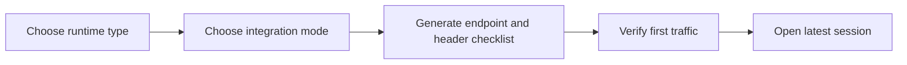
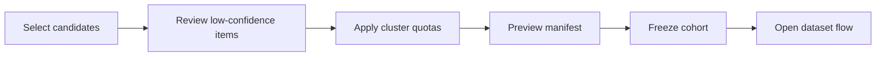
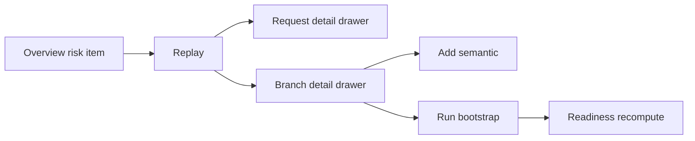

# ClawGraph Dashboard 页面线框与交互流拆解

## 1. 文档目的

本文是 [面向用户的 Dashboard 产品设计](./user_dashboard_prd.zh-CN.md) 的下一层拆解。

上一份文档回答的是：

- 为什么要做这套 Dashboard
- 模块怎么映射到底层对象
- 哪些是 MVP，哪些是近端增强，哪些是 roadmap

本文回答的是：

- 每个页面长什么样
- 每个页面有哪些信息区块
- 用户从哪里进入，点击什么，跳到哪里
- 不同状态下页面如何反馈
- 多页面之间如何构成可执行的一站式任务流

本文默认以桌面端为主，平板端次之，移动端只保留只读浏览和轻量审批能力。

## 2. 设计方法

### 2.1 低保真原则

本文使用低保真线框，不讨论：

- 视觉风格
- 品牌色
- 字体
- 动效细节

本文重点讨论：

- 页面骨架
- 信息层级
- 交互路径
- 对象关系
- 状态变化

### 2.2 线框阅读约定

- 左侧是全局导航
- 中间是主工作区
- 右侧是上下文详情抽屉或辅助面板
- 顶部是环境、搜索、全局筛选和快捷动作
- 所有对象详情页都遵循“概览 + 主表格/主图 + 右侧详情”的结构

## 3. 全局 Shell

### 3.1 全局页面框架

```text
+------------------------------------------------------------------------------------------------------------------+
| Top Bar                                                                                                          |
| [Workspace] [Env] [Global Search / Command]                           [Time Range] [Role] [Alerts] [User Menu] |
+----------------------+-------------------------------------------------------------------------------------------+
| Left Nav             | Main Workspace                                                                            |
|                      |                                                                                           |
| Overview             | Page Header                                                                               |
| Access               | [Title] [Object Scope] [Primary CTA] [Secondary CTA]                                      |
| Session Inbox        |-------------------------------------------------------------------------------------------|
| Replay               | Local Filter Bar                                                                          |
| Supervision          | [Saved View] [Slice] [Builder] [Risk] [Status] [Search]                                   |
| Curation             |-------------------------------------------------------------------------------------------|
| Datasets             | Main Content                                                                              |
| Evaluation           |                                                                                           |
| Coverage             |                                                                                           |
| Feedback             |                                                                                           |
|                      |                                                                                           |
|                      |                                                                                           |
|                      |                                                                                           |
+----------------------+--------------------------------------------------------------------+----------------------+
| Footer / Jobs / Sync | Optional Bottom Tray                                               | Right Context Panel  |
| Export jobs          | background pipelines, dry-run results, warnings, blockers          | or Drawer            |
+----------------------+--------------------------------------------------------------------+----------------------+
```

### 3.2 Top Bar 组件

必备组件：

- `Workspace selector`
  多项目、多客户、多环境切换
- `Environment selector`
  local / staging / prod / shadow
- `Global command bar`
  支持输入：
  - session id
  - run id
  - branch id
  - request id
  - cohort id
  - dataset snapshot id
  - scorecard id
- `Time range`
  最近 1h / 24h / 7d / 30d / 自定义
- `Alert center`
  readiness blocker、shadow regression、payload overflow、new subtype
- `Role switcher`
  不切换权限，只切换预设视图布局

### 3.3 Left Nav 设计

左侧导航分三组：

#### A. Operate

- `Overview`
- `Access`
- `Session Inbox`
- `Replay`
- `Supervision`

#### B. Govern

- `Curation`
- `Datasets`
- `Evaluation`
- `Coverage`

#### C. Loop

- `Feedback`

### 3.4 Right Context Panel

右侧上下文面板统一承担 4 类职责：

1. 对象摘要
2. 推荐下一步
3. 相关对象跳转
4. 风险 / blocker 提示

例如在 `Replay` 中点一个 branch，右侧显示：

- branch 摘要
- artifacts 覆盖
- related requests
- latest failed step
- next actions:
  - add semantic
  - bootstrap artifact
  - compare with sibling branch

### 3.5 底部 Job Tray

所有异步动作都进入底部 Job Tray：

- artifact bootstrap
- readiness recompute
- cohort freeze
- export dataset
- eval suite build
- scorecard update

状态：

- queued
- running
- completed
- failed

点击后可展开日志、下载结果、跳转对象详情。

## 4. 共享交互模式

### 4.1 标准对象卡片

每个一等对象统一使用卡片头：

```text
+-----------------------------------------------------------------------------------------------------+
| session: sess_123                                                                                   |
| Status: active    Evidence: E1    Updated: 5m ago    Owner: ml-team                                 |
| Runs: 8  Requests: 143  Branches: 19  Active Artifacts: 22                                          |
| [Open] [Compare] [Export Related] [More]                                                            |
+-----------------------------------------------------------------------------------------------------+
```

### 4.2 状态标签标准

#### Evidence 标签

- `E0 replay-ready`
- `E1 curation-ready`
- `E2 decision-ready`

#### Governance 标签

- `training`
- `evaluation`
- `diagnostics`

#### Execution 标签

- `open`
- `succeeded`
- `failed`

#### Decision 标签

- `pass`
- `hold`
- `fail`

### 4.3 标准 CTA 规则

每个页面只保留 1 个主 CTA。

建议如下：

- `Overview`: `Start Guided Flow`
- `Access`: `Create Integration`
- `Session Inbox`: `Review Latest Session`
- `Replay`: `Inspect Failure`
- `Supervision`: `Run Bootstrap`
- `Curation`: `Freeze Cohort`
- `Datasets`: `Export Snapshot`
- `Evaluation`: `Create Eval Suite`
- `Coverage`: `Update Coverage Decision`
- `Feedback`: `Enqueue Feedback`

### 4.4 标准详情打开方式

#### 行内详情

适合：

- request
- artifact
- feedback item

方式：

- 右侧抽屉

#### 全页面详情

适合：

- session
- run
- cohort
- dataset snapshot
- eval suite
- scorecard

方式：

- 新页面或当前页 drill-down

### 4.5 标准筛选栏

所有列表页共享同一行筛选结构：

```text
[Saved View] [Environment] [Time Range] [Status] [Owner] [Risk] [Search ids / names]
```

对象相关页再补局部筛选：

- `Session Inbox`: evidence、branch source、artifact coverage
- `Curation`: slice、quality confidence、verifier score
- `Datasets`: builder、sample unit、snapshot status
- `Evaluation`: suite kind、verdict、candidate model

## 5. 全局状态设计

### 5.1 Loading

统一使用三层骨架：

- 页面级 skeleton
- 表格级 skeleton
- 右侧抽屉级 skeleton

### 5.2 Empty

空态不能只写 “No data”。

必须包含：

- 原因
- 建议动作
- 直接 CTA

示例：

```text
No captured sessions yet.
Route your model or tool endpoints to ClawGraph proxy first.
[Open Access Setup]
```

### 5.3 Error

错误态分三类：

- `data unavailable`
- `permission denied`
- `action failed`

动作失败必须说明：

- 失败对象
- 失败阶段
- 失败原因
- 是否可重试

### 5.4 Partial Data

很多页面会遇到“部分对象已存在，但证据不完整”的情况。

必须显式展示：

- 有哪些字段缺失
- 当前页面还能做什么
- 哪个上游模块可以补齐

## 6. 关键页面线框

### 6.1 Overview

#### 页面目标

让负责人、PM、BD 在 30 秒内回答：

- 采集健康吗
- 资产产出了多少
- 哪些 slice 有替代机会
- 最近有哪些风险

#### 线框

```text
+------------------------------------------------------------------------------------------------------+
| Overview                                     [Start Guided Flow] [Export Summary] [Share]            |
+------------------------------------------------------------------------------------------------------+
| KPI Row                                                                                              |
| [Captured Sessions] [Captured Runs] [E1 Rate] [E2 Rate] [Export-ready Runs] [Snapshots] [Pass Rate] |
+------------------------------------------------------------------------------------------------------+
| Health Matrix                              | Opportunity Board                                       |
| capture health                             | slice.capture      opportunity: high                    |
| branch fidelity                            | slice.tool_call    opportunity: medium                  |
| supervision coverage                       | slice.research     blocked by risk                      |
| dataset readiness                          | ...                                                      |
+------------------------------------------------------------------------------------------------------+
| Recent Risk Feed                           | Business Lens                                           |
| - new subtype spike                        | time to first replay                                    |
| - fallback rate up                         | sessions to dataset yield                               |
| - shadow regression                        | estimated cost-down potential                           |
+------------------------------------------------------------------------------------------------------+
| Quick Entry                                                                                           |
| [Connect Runtime] [Investigate Failure] [Build Dataset] [Validate Slice Replacement] [Review Feedback]|
+------------------------------------------------------------------------------------------------------+
```

#### 核心交互

1. 点击 KPI 卡片进入对应列表页。
2. 点击 `opportunity board` 某个 slice，跳到 `Coverage` 并自动带筛选。
3. 点击风险 feed 某条风险，跳到对应页面并自动定位对象。
4. 点击 Quick Entry 进入对应 guided flow。

#### 关键状态

- 无数据时，主 CTA 只保留 `Connect Runtime`
- 有采集但无 supervision 时，Quick Entry 优先推荐 `Run Bootstrap`
- 有 snapshot 但无 eval 时，Quick Entry 优先推荐 `Validate Slice Replacement`

### 6.2 Access

#### 页面目标

让用户明确当前接入方式、接入成熟度和下一步该补什么。

#### 线框

```text
+------------------------------------------------------------------------------------------------------+
| Access                                       [Create Integration] [View Examples]                     |
+------------------------------------------------------------------------------------------------------+
| Connection Status                                                                                   |
| Env        Proxy Health   Req/min   Error Rate   Avg Latency   Last Event                            |
| prod       healthy        430       0.4%         320ms         2s ago                                |
| shadow     warning        58        3.1%         510ms         12s ago                               |
+------------------------------------------------------------------------------------------------------+
| Integration Modes                                                                                   |
| [Transparent Proxy] [Proxy + Context Headers] [Proxy + Semantic Contract]                            |
+------------------------------------------------------------------------------------------------------+
| Identity / Semantic Checklist                 | Payload Management                                    |
| session_id coverage                           | payload spills by env                                 |
| run_id coverage                               | largest payloads                                      |
| user_id / thread_id coverage                  | gc recommendation                                     |
| retry / fallback / route coverage             | [Run GC]                                              |
+------------------------------------------------------------------------------------------------------+
| Right Panel: Selected integration details                                                             |
| - required headers                                                                            |
| - sample code                                                                                  |
| - rollout recommendation                                                                      |
+------------------------------------------------------------------------------------------------------+
```

#### 核心交互

1. 切换 integration mode 卡片，右侧更新接入要求和示例。
2. 点击某个 coverage 指标，打开覆盖率详情抽屉。
3. 点击 `View Examples` 打开：
   - proxy minimal
   - python helper
   - openai wrapper
4. 点击 `Run GC` 发起异步任务，结果进入 Job Tray。

#### 接入向导交互



### 6.3 Session Inbox

#### 页面目标

作为 evidence layer 的收件箱，对新采集运行做分诊。

#### 页面结构

- 上半区是 session 列表
- 中间是 run 级 summary
- 下半区是 anomaly feed
- 右侧是选中对象详情

#### 线框

```text
+------------------------------------------------------------------------------------------------------+
| Session Inbox                                   [Review Latest Session] [Saved Views]                |
+------------------------------------------------------------------------------------------------------+
| Filters: [Env] [Time] [Evidence Level] [Outcome] [Branch Source] [Artifact Coverage] [Search]      |
+------------------------------------------------------------------------------------------------------+
| Session List                              | Selected Session Summary                                |
| sess_123  3 runs  E1                      | Session: sess_123                                       |
| sess_122  1 run   E0                      | Runs: 3  Requests: 48  Branches: 7                      |
| sess_121  5 runs  E2                      | Success: 38  Failure: 8  Open: 2                        |
| ...                                       | Declared branches: 3  Inferred: 4                       |
+-------------------------------------------+----------------------------------------------------------+
| Run Quality Table                                                                                   |
| run_id       req  succ fail open  branch  declared%  artf  evidence  avg lat  actions               |
| run_1        18   14   3    1     4       50%        6     E1        280ms    [Replay] [Bootstrap] |
| run_2        11   11   0    0     1       100%       9     E2        190ms    [Replay] [Export]    |
+------------------------------------------------------------------------------------------------------+
| Anomaly Feed                                                                                         |
| - run_1 has open spans                                                                              |
| - run_1 missing task_instance_key                                                                   |
| - run_3 branch inference confidence low                                                             |
+------------------------------------------------------------------------------------------------------+
```

#### 核心交互

1. 点 session 行，更新右侧 summary 和 run table。
2. 点 run 的 `Replay`，进入 `Replay` 页面并带 `session_id + run_id`。
3. 点 run 的 `Bootstrap`，打开 `Supervision` modal，默认选 `openclaw-defaults`。
4. 点 run 的 `Export`，跳转 `Datasets` 并做 readiness dry-run。
5. 点 anomaly，打开对应缺失字段说明和建议动作。

#### 右侧详情抽屉字段

- session_id
- user ids
- recent runs
- request count
- evidence level
- missing annotation fields
- suggested next actions

### 6.4 Replay

#### 页面目标

让用户快速理解一条 run 或一个 session 里到底发生了什么。

#### 页面布局

Replay 是唯一允许“图 + 表 + 详情”同时出现的重交互页面。

#### 线框

```text
+------------------------------------------------------------------------------------------------------+
| Replay: session sess_123 / run run_1                  [Inspect Failure] [Compare Branches] [Share]  |
+------------------------------------------------------------------------------------------------------+
| Replay Summary                                                                                       |
| Outcome: failed   Requests: 18   Branches: 4   Declared: 2   Inferred: 2   Active Artifacts: 6      |
+------------------------------------------------------------------------------------------------------+
| Timeline                                                                                             |
| req_1 --- resp_1 --- req_2 --- err_2 --- retry branch open --- req_3 --- resp_3 --- fallback ...   |
+------------------------------------------------------------------------------------------------------+
| Branch Tree                                   | Request Span Table                                    |
| br_main     failed  inferred                  | req_id  actor  path        outcome  status  lat  artf |
|  ├ br_retry succeeded declared                | req_1   model  /responses  ok       200     190  1    |
|  └ br_fb    failed  declared                  | req_2   tool   /tools/x    fail     500     840  2    |
|                                               | ...                                                   |
+-----------------------------------------------+------------------------------------------------------+
| Bottom Tabs                                                                                          |
| [Artifacts Overlay] [Payload Preview] [Semantic Events] [Export Readiness]                          |
+------------------------------------------------------------------------------------------------------+
| Right Panel: Selected branch/request                                                                  |
| summary | related artifacts | parent/child relations | next actions                                  |
+------------------------------------------------------------------------------------------------------+
```

#### 核心交互

1. 点击时间线节点，高亮对应 request span 和 branch。
2. 点击 branch tree 节点，右侧展示：
   - branch type
   - source
   - status
   - parent
   - related artifacts
3. 点击 request 行，底部切换到 payload preview。
4. 切到 `Export Readiness` tab，可直接看到：
   - `sft`
   - `preference`
   - `binary_rl`
   的 readiness 和 blockers。

#### 快速动作

- `Inspect latest failed branch`
- `Add semantic event`
- `Bootstrap artifacts`
- `Dry-run export`

### 6.5 Supervision

#### 页面目标

把 supervision 相关操作集中，不让用户在 replay 里零散补充。

#### 页面布局

```text
+------------------------------------------------------------------------------------------------------+
| Supervision                                    [Run Bootstrap] [Append Artifact] [Append Semantic]   |
+------------------------------------------------------------------------------------------------------+
| Scope Selector                                                                                       |
| Target scope: [Session] [Run] [Branch] [Request / Fact]                                               |
+------------------------------------------------------------------------------------------------------+
| Left: Template / Type Catalog                  | Center: Existing Supervision                          |
| Templates                                      | artifact_id  type        target      producer  status |
| - openclaw-defaults                            | art_1        annotation  run:...     clawgraph active |
| - request-outcome-scores                       | art_2        preference  run:...     team.jdg active  |
| - branch-outcome-preference                    | ...                                                   |
| - e1-annotations                               |                                                       |
+-----------------------------------------------+------------------------------------------------------+
| Bottom: Governance Inspector                                                                        |
| selected artifact version | confidence | supersedes | created_at | payload preview                   |
+------------------------------------------------------------------------------------------------------+
| Right Panel: Suggested next steps                                                                    |
| - run missing verifier-backed score                                                                  |
| - branch pair available for preference bootstrap                                                     |
| - semantic route missing                                                                             |
+------------------------------------------------------------------------------------------------------+
```

#### 核心交互

1. 先选 target scope。
2. 左侧点模板，中央预览将生成什么 artifacts。
3. 点击 `Run Bootstrap`，弹 modal：
   - template
   - producer
   - version
   - dry-run
4. artifact 列表支持 compare 历史版本。
5. semantic append 支持从 replay 直接带入 branch_id / request_id。

#### Modal 线框

```text
+-----------------------------------------------------------------------------------+
| Run Bootstrap                                                                     |
+-----------------------------------------------------------------------------------+
| Template: [openclaw-defaults v]                                                   |
| Scope: run:run_1                                                                  |
| Producer: [clawgraph.openclaw-defaults____]                                       |
| Version:  [optional_______________________]                                       |
| Dry-run:  [x]                                                                     |
|-----------------------------------------------------------------------------------|
| Preview                                                                           |
| - 1 annotation artifact                                                           |
| - 3 request score artifacts                                                       |
| - 1 branch preference artifact                                                    |
|-----------------------------------------------------------------------------------|
| [Cancel]                                                       [Run Bootstrap]    |
+-----------------------------------------------------------------------------------+
```

### 6.6 Curation

`Curation` 拆成 3 个子页：`Slice Registry`、`Candidate Pool`、`Cohort Review`。

#### 6.6.1 Slice Registry

```text
+------------------------------------------------------------------------------------------------------+
| Curation / Slice Registry                         [Create Slice] [Import Metadata]                    |
+------------------------------------------------------------------------------------------------------+
| slice_id          task_family            task_type              risk   default_use    owner          |
| slice.capture     captured_agent_task    generic_proxy_capture  med    training       ml-team        |
| slice.tools       tool_use               api_lookup             low    training       agent-team     |
| slice.research    long_agent_task        multi_step_research    high   diagnostics    pm-team        |
+------------------------------------------------------------------------------------------------------+
| Right Panel: Selected slice                                                                        |
| taxonomy version | sample unit | verifier contract | metadata | related cohorts | related snapshots |
+------------------------------------------------------------------------------------------------------+
```

#### 交互

1. 点击 `Create Slice` 打开表单。
2. 点击某个 slice，右侧展示详情和下游对象。
3. 点击 `View Candidates`，跳到 `Candidate Pool` 并带 `slice_id`。

#### 6.6.2 Candidate Pool

```text
+------------------------------------------------------------------------------------------------------+
| Curation / Candidate Pool                     slice: slice.capture            [Freeze Cohort]         |
+------------------------------------------------------------------------------------------------------+
| Filters: [session] [run] [task instance] [template hash] [quality >=] [verifier >=] [source]       |
+------------------------------------------------------------------------------------------------------+
| Candidate Stats                                                                                      |
| total: 324   eligible: 271   review queue: 33   holdout: 20                                           |
+------------------------------------------------------------------------------------------------------+
| Candidate Table                                                                                      |
| run_id   task_instance   template_hash   quality  verifier  source   cluster  status    select        |
| run_1    ti_001          tpl_a           0.92     0.88      prod     c_12     eligible  [x]           |
| run_2    ti_002          tpl_a           0.41     0.65      prod     c_12     review    [ ]           |
+------------------------------------------------------------------------------------------------------+
| Bottom Panels                                                                                        |
| [Cluster View] [Review Queue] [Holdout Feed] [Annotation Coverage]                                   |
+------------------------------------------------------------------------------------------------------+
```

#### Cluster View

```text
cluster c_12
- task_template_hash: tpl_a
- members: 18
- selected: 3
- skipped by quota: 11
- review required: 4
```

#### Review Queue

显示原因：

- low quality confidence
- verifier score below threshold
- unknown subtype
- conflicting task instance
- missing annotation fields

#### 6.6.3 Cohort Review

```text
+------------------------------------------------------------------------------------------------------+
| Curation / Cohort Review                      [Freeze Cohort] [Save Draft View]                       |
+------------------------------------------------------------------------------------------------------+
| Cohort Summary                                                                                       |
| slice: slice.capture   selected: 271   holdout: 20   review: 33   purpose: training                 |
+------------------------------------------------------------------------------------------------------+
| Members Table                                                                                         |
| run_id  task_instance  template_hash  quality  verifier  frozen_artifacts  source                     |
+------------------------------------------------------------------------------------------------------+
| Manifest Preview                               | Excluded Reasons                                     |
| time range                                     | low confidence: 18                                   |
| task distribution                              | verifier below bar: 9                                |
| cluster stats                                  | duplicate quota: 11                                  |
| quality gate                                   | ...                                                  |
+------------------------------------------------------------------------------------------------------+
| Right Panel: Freeze Config                                                                       |
| name | cohort_id (optional) | purpose | holdout fraction | quota policy | confirm                  |
+------------------------------------------------------------------------------------------------------+
```

#### Freeze 流程



### 6.7 Datasets

#### 页面目标

把“能不能导出、导出什么、导出后长什么样”可视化。

#### 线框

```text
+------------------------------------------------------------------------------------------------------+
| Datasets                                        [Export Snapshot] [Dry-run Export]                   |
+------------------------------------------------------------------------------------------------------+
| Builder Catalog                                                                                      |
| [facts] [sft] [preference] [binary_rl]                                                               |
+------------------------------------------------------------------------------------------------------+
| Readiness Summary                                                                                     |
| builder      ready   predicted records   blockers                                                     |
| sft          yes     218                 none                                                         |
| preference   no      43                  missing active preference artifacts                          |
| binary_rl    yes     71                  none                                                         |
+------------------------------------------------------------------------------------------------------+
| Snapshot History                              | Selected Snapshot                                     |
| ds_001  sft   218 rec  cohort_1              | manifest                                              |
| ds_002  binary_rl 71 rec cohort_1            | split rules                                           |
| ...                                          | lineage                                               |
+-----------------------------------------------+------------------------------------------------------+
| Bottom Tabs                                                                                           |
| [Manifest Explorer] [Record Preview] [Lineage] [Blocker Analysis]                                    |
+------------------------------------------------------------------------------------------------------+
```

#### 核心交互

1. 切 builder，刷新 readiness。
2. 点击 blocker，弹出“去哪里补”：
   - 缺 artifact -> `Supervision`
   - 缺 cohort -> `Curation`
   - 低 evidence -> `Session Inbox`
3. 点击 snapshot 行，右侧展示 manifest。
4. `Dry-run Export` 直接在底部 tray 产生预览结果。

#### Export Modal

```text
+-----------------------------------------------------------------------------------+
| Export Snapshot                                                                    |
+-----------------------------------------------------------------------------------+
| Builder: [preference v]                                                            |
| Source:  [Cohort cohort_1 v]                                                       |
| Output path: [out/preference.jsonl____________________________]                    |
| Dry-run first: [x]                                                                 |
|-----------------------------------------------------------------------------------|
| Readiness                                                                          |
| ready: no                                                                          |
| blocker: missing active preference artifacts                                       |
|-----------------------------------------------------------------------------------|
| [Cancel]                                                       [Run Dry-run]       |
+-----------------------------------------------------------------------------------+
```

### 6.8 Evaluation

#### 页面目标

把“评测资产、分数卡、上线判断”放到一个明确的验证工作台中。

#### 线框

```text
+------------------------------------------------------------------------------------------------------+
| Evaluation                                    [Create Eval Suite] [Record Scorecard]                 |
+------------------------------------------------------------------------------------------------------+
| Suite Board                                                                                          |
| eval_suite     slice           kind        source cohort   status   items                             |
| eval_001       slice.capture   offline     cohort_eval_1  active   320                               |
| eval_002       slice.capture   shadow      cohort_eval_2  active   88                                |
+------------------------------------------------------------------------------------------------------+
| Scorecard Board                                                                                        |
| candidate model | baseline | verdict | success | verifier | p95 | cost | fallback | updated         |
| qwen-small      | gpt-4     | pass    | 0.94    | 0.91     | 1.2s| 0.3x | 0.06     | 5m ago         |
+------------------------------------------------------------------------------------------------------+
| Decision Panel                                                                                            |
| latest decision: promote to shadow                                                                     |
| rollback conditions: verifier drop > 3%, fallback > 10%, safety regression                            |
+------------------------------------------------------------------------------------------------------+
```

#### 核心交互

1. 从某个 evaluation cohort 发起 `Create Eval Suite`。
2. 录入 scorecard 时自动计算 `pass / hold / fail`。
3. 决策面板支持：
   - promote
   - hold
   - rollback
4. 所有 decision 都要引用 scorecard。

### 6.9 Coverage

#### 页面目标

把 `slice -> recipe -> model band -> rollout stage` 讲清楚。

#### 线框

```text
+------------------------------------------------------------------------------------------------------+
| Coverage                                      [Update Coverage Decision] [Export Report]             |
+------------------------------------------------------------------------------------------------------+
| Slice Coverage Matrix                                                                                 |
| slice          verifier  risk  complexity  recipe                 model band  eval verdict  rollout  |
| slice.capture  strong    med   low         sft + binary_rl        1.5B-3B     pass         canary   |
| slice.tools    strong    low   med         sft + binary_rl        3B          pass         expand    |
| slice.research weak      high  high        selective distill       7B+         hold         offline   |
+------------------------------------------------------------------------------------------------------+
| Fallback Guardrails                          | Selected Slice Detail                                  |
| unknown subtype                              | evidence level                                          |
| long context                                 | latest dataset snapshot                                 |
| deep tool path                               | latest scorecard                                        |
| verifier fail spike                          | recommended next stage                                  |
+------------------------------------------------------------------------------------------------------+
```

#### 核心交互

1. 点击某个 slice 行，右侧展示完整替代依据。
2. 如果缺数据，右侧给出下一步：
   - create evaluation cohort
   - record scorecard
   - improve evidence level
3. 如果指标回退，CTA 变成 `Rollback`.

### 6.10 Feedback

#### 页面目标

把所有需要回流的样本集中起来，不让失败样本消失。

#### 线框

```text
+------------------------------------------------------------------------------------------------------+
| Feedback                                      [Enqueue Feedback] [Bulk Route]                        |
+------------------------------------------------------------------------------------------------------+
| Queue                                                                                                 |
| feedback_id   source        target_ref        reason              slice         status                 |
| fb_001        fallback      run:run_1         verifier fail       slice.capture open                  |
| fb_002        disagreement  branch:br_2       model disagreement  slice.tools   open                  |
+------------------------------------------------------------------------------------------------------+
| Bottom Split                                                                                           |
| Left: Detail                                                                                           |
| - payload                                                                                              |
| - related session/run/branch                                                                           |
| - source scorecard or runtime signal                                                                   |
| Right: Route                                                                                            |
| [Send to Session Inbox] [Send to Supervision] [Send to Curation] [Refresh Cohort]                    |
+------------------------------------------------------------------------------------------------------+
```

#### 核心交互

1. 选中 feedback item。
2. 右侧显示关联对象。
3. 用户选择回流去向。
4. 系统写入状态变更并记录关联链路。

## 7. 关键对象详情页模板

### 7.1 Session 详情页

```text
Header: session id | evidence level | runs | requests | branches | artifacts
Tabs:
- Summary
- Runs
- Requests
- Branches
- Artifacts
- Related Cohorts
```

### 7.2 Cohort 详情页

```text
Header: cohort id | purpose | slice ids | member count | created_at
Tabs:
- Manifest
- Members
- Holdout
- Review
- Related Snapshots
- Related Eval Suites
```

### 7.3 Dataset Snapshot 详情页

```text
Header: dataset_snapshot_id | builder | record_count | cohort_id
Tabs:
- Manifest
- Split Distribution
- Record Preview
- Lineage
- Export History
```

### 7.4 Scorecard 详情页

```text
Header: scorecard id | candidate model | baseline | verdict
Tabs:
- Metrics
- Thresholds
- Decision History
- Failure Analysis
- Related Coverage Policy
```

## 8. 五条核心交互流

### 8.1 流一：首次接入

#### 入口

- `Overview > Connect Runtime`
- `Access > Create Integration`

#### 步骤

1. 选择 runtime 类型。
2. 选择接入模式。
3. 生成 endpoint / header / semantic checklist。
4. 用户点击 `Verify first traffic`。
5. 系统检测最近 5 分钟是否有 captured request。
6. 若有，跳转 `Session Inbox` 并高亮最新 session。
7. 用户点击 `Open Replay`。

#### 分支

- 若无流量：
  页面显示 sample curl / example code。
- 若有流量但 E0 only：
  页面建议先做 replay。
- 若 replay grouping 弱：
  页面建议补 context headers。

### 8.2 流二：排查失败 run

#### 入口

- `Overview > Investigate Failure`
- `Session Inbox > anomaly`
- `Replay > Inspect Failure`

#### 步骤

1. 系统默认选最近失败率最高的 run。
2. 进入 `Replay`。
3. 自动高亮 latest failed branch。
4. 底部打开 `Export Readiness` tab。
5. 若缺 semantic，右侧显示 `Add semantic`。
6. 若缺 artifacts，右侧显示 `Run Bootstrap`。
7. 完成后可返回 `Session Inbox`，状态更新。

#### 页面跳转图



### 8.3 流三：生成训练集

#### 入口

- `Overview > Build Dataset`
- `Datasets > Export Snapshot`

#### 步骤

1. 先选 builder。
2. 系统检查是否已有 cohort。
3. 若无 cohort，跳 `Curation / Candidate Pool`。
4. 用户筛选 candidates，进入 `Cohort Review`。
5. 用户点击 `Freeze Cohort`。
6. 冻结成功后跳转 `Datasets`。
7. 系统自动执行 readiness dry-run。
8. 用户查看 blockers 或直接导出。

#### 异常分支

- 缺 annotation：
  跳 `Supervision`。
- 缺 verifier：
  降级只建议 `sft`，不建议 `binary_rl`。
- 缺 preference artifacts：
  建议执行 `branch-outcome-preference` bootstrap。

### 8.4 流四：验证 slice 替代

#### 入口

- `Overview > Validate Slice Replacement`
- `Coverage > selected slice`

#### 步骤

1. 进入 `Coverage`。
2. 选一个 slice。
3. 系统检查：
   - 是否有 evaluation cohort
   - 是否有 eval suite
   - 是否有 scorecard
4. 若无 evaluation cohort，提示从 `Curation` 冻结 `purpose=evaluation` cohort。
5. 进入 `Evaluation` 创建 eval suite。
6. 录入 scorecard。
7. 系统自动计算 verdict。
8. 用户创建 promotion decision。
9. 跳回 `Coverage` 更新 rollout stage。

### 8.5 流五：失败样本回流

#### 入口

- `Feedback`
- `Evaluation` 中失败 scorecard
- `Coverage` 中 rollback

#### 步骤

1. 把异常样本送入 `Feedback Queue`。
2. 用户批量选择回流路径：
   - `Session Inbox`
   - `Supervision`
   - `Curation`
   - `Cohort Refresh`
3. 系统写入状态变更并关联：
   - source scorecard
   - source decision
   - related slice
4. 在下一轮 cohort refresh 时给出“包含回流样本”的标记。

## 9. 页面之间的链接规则

为避免页面孤岛，必须定义强跳转关系。

### 9.1 Session 相关

- `Session Inbox -> Replay`
- `Session Inbox -> Supervision`
- `Session Inbox -> Curation`

### 9.2 Cohort 相关

- `Curation -> Datasets`
- `Curation -> Evaluation`

### 9.3 Decision 相关

- `Evaluation -> Coverage`
- `Coverage -> Feedback`

### 9.4 回流相关

- `Feedback -> Session Inbox`
- `Feedback -> Supervision`
- `Feedback -> Curation`

## 10. MVP 页面优先级

### P0

- Overview
- Access
- Session Inbox
- Replay
- Supervision
- Curation
- Datasets

### P1

- Evaluation
- Feedback

### P2

- Coverage

## 11. 前端实现建议

### 11.1 路由建议

```text
/overview
/access
/sessions
/sessions/:sessionId
/sessions/:sessionId/runs/:runId/replay
/supervision
/curation/slices
/curation/candidates
/curation/cohorts/:cohortId
/datasets
/datasets/:snapshotId
/evaluation
/evaluation/:suiteId
/coverage
/feedback
```

### 11.2 页面装配建议

- 列表页统一用 server-side filtering
- 详情页统一支持 URL 深链接
- 右侧抽屉状态同步到 query params
- Guided Flow 用独立 route，不要只做弹窗

### 11.3 数据加载建议

- Overview 和 Session Inbox 支持轮询
- Replay 和 Datasets 以主动刷新为主
- 所有异步任务通过 Job Tray 返回

## 12. 结论

这一版线框和交互流的核心目标，是把 ClawGraph 从“对象很多、命令很多”的系统，整理成用户能顺着做事的控制台。

页面层面有三个关键判断：

1. 以 `Session Inbox` 作为 evidence 收件箱，而不是直接从 replay 开始。
2. 以 `Curation -> Datasets -> Evaluation -> Coverage -> Feedback` 形成治理和决策闭环。
3. 以 Guided Flow 串联复杂工作，但不破坏底层对象边界。

如果下一步继续推进，最自然的工作就是：

- 把本文转换成 Figma 页面树和组件树
- 补每个页面的字段级数据 contract
- 再把 P0 页面落成前端实现规格
